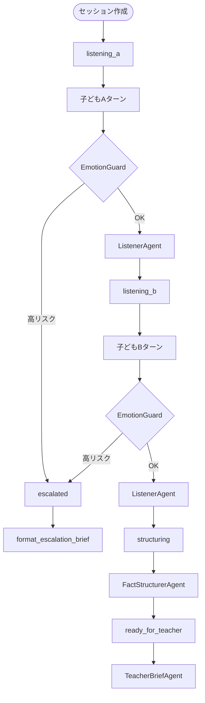

# ビジネスロジックモデル — unit-agent-core

## 概要

`unit-agent-core` は仲介セッション1件について、**裁かない**多段エージェント処理を実行する。外部（API / Kebbi / Web）からは `MediationWorkflow` が唯一のオーケストレーション入口。

## コア処理フロー



### MVP スコープ（P0）

- **含む**: create_session → listening_a/b → structuring → ready_for_teacher → teacher brief
- **含む**: 各ターン前の EmotionGuard（ルールベース）
- **P1（設計済み・実装予定）**: confirming_a/b → ConfirmationAgent

## 主要ユースケース

### UC-01: セッション開始

| 項目 | 内容 |
|------|------|
| 入力 | `session_id`, `child_a_label`, `child_b_label`, `clientChannel`（任意、既定 `web`） |
| 処理 | `SessionState` 生成、状態 `listening_a`、`client_channel` 保存 |
| 出力 | `SessionState`, `welcome_message` |
| ルール | ラベル未指定時は「子どもA」「子どもB」；Kebbi は `client: kebbi` を推奨 |

### UC-02: 子どもターン処理

| 項目 | 内容 |
|------|------|
| 入力 | `SessionState`, `child_id`（a/b）, `utterance` |
| 前処理 | EmotionGuard.assess_risk → should_escalate |
| エスカレーション時 | mark_escalated、固定メッセージ返却、仲介続行しない |
| 通常時 | ChildTurn 追加 → ListenerAgent.listen_turn → advance_after_turn |
| 双方完了時 | FactStructurerAgent.structure → structured 保存 → ready_for_teacher |
| 出力 | 更新 `SessionState`, `agent_message`, `escalated` フラグ |

### UC-03: 先生ブリーフ取得

| 項目 | 内容 |
|------|------|
| 入力 | `SessionState` |
| 分岐 | escalated → format_escalation_brief / 通常 → generate_brief |
| 出力 | `TeacherBrief`（必ず `ai_disclaimer` 含む） |

### UC-04: 確認ループ（P1）

| 項目 | 内容 |
|------|------|
| トリガー | structuring 完了後、confirming_a → confirming_b |
| 処理 | ConfirmationAgent.summarize_for_child → process_correction → merge_corrections |
| 出力 | 訂正反映済み `StructuredFacts` |

## エージェント責務マトリクス

| エージェント | 呼び出しタイミング | 入力 | 出力 |
|--------------|-------------------|------|------|
| ChildNavigatorAgent | 名前収集・番交代・finish 案内 | child_id, name, client_channel | agent_message |
| EmotionGuardAgent | 毎ターン最初 | utterance | RiskAssessment |
| ListenerAgent | エスカレーションなし | child_label, utterance, セッション文脈 | ListenerResponse |
| FactStructurerAgent | 双方ヒアリング完了 | SessionState（全 turns） | StructuredFacts |
| ConfirmationAgent | confirming_*（P1） | child_id, StructuredFacts | 要約文 / ConfirmationResult |
| TeacherBriefAgent | ready_for_teacher / escalated | SessionState, StructuredFacts | TeacherBrief |
| SessionOrchestrator | 状態遷移・ルーティング | SessionState, event | SessionState, agent_name |

## ADK 置換方針（Code Generation 向け）

現行スタブを以下に置換:

1. **ListenerAgent** — ADK Agent + `listener.md` プロンプト。JSON schema で `ListenerResponse` を返す
2. **FactStructurerAgent** — ADK Agent + `fact_structurer.md`。`StructuredFacts` を生成
3. **ConfirmationAgent** — ADK Agent（P1）。子ども向け要約文
4. **TeacherBriefAgent** — ADK Agent + `teacher_brief.md`。`TeacherBrief` を生成
5. **EmotionGuardAgent** — MVP はルールベース維持。Phase 2 で Gemini 補助オプション

`MediationWorkflow` と `SessionOrchestrator` の**状態機械は変更しない**（API 契約との整合）。

## データ変換

```text
子ども発話 (utterance)
  → [Guard] RiskAssessment
  → [Listener]  supportive agent_message
  → [蓄積] ChildTurn list (turns_a / turns_b)
  → [Structurer] StructuredFacts
      ├── child_a: facts[], feelings[], unknowns[]
      ├── child_b: facts[], feelings[], unknowns[]
      ├── agreements[], disagreements[], unknowns[]
  → [Brief] TeacherBrief + ai_disclaimer + suggested_questions
```

## エラー・境界条件

| 条件 | 振る舞い |
|------|----------|
| 非アクティブ child_id でターン | API 層で拒否（unit-api 責務）；core は入力検証のみ |
| 空 utterance | Listener が優しく促す；ターンは記録しない or 記録して促し（API と合意） |
| structured 未生成で brief 要求 | 空 StructuredFacts で生成；unknowns に「情報不足」を記載 |
| エスカレーション後の追加ターン | 処理しない；escalated 状態維持 |

## 関連ストーリー

- **US-02**: FactStructurer + TeacherBrief（事実/感情/不明点分離）
- **US-05**: EmotionGuard + escalated 遷移
- **US-01**: Listener（子どもヒアリング）
- **US-03**: ConfirmationAgent（P1）
- **US-04**: TeacherBriefAgent
