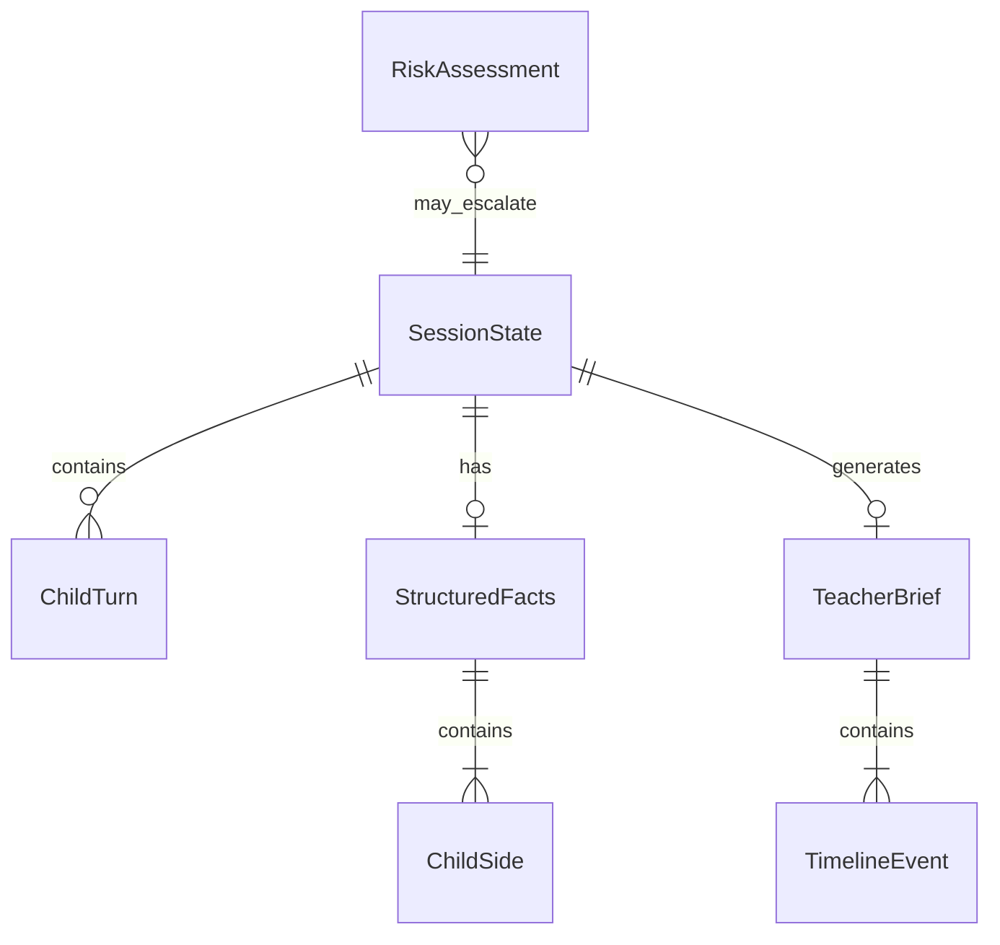

# ドメインエンティティ — unit-agent-core

## エンティティ関係

## SessionState（集約ルート）

仲介セッション1件の状態。`MediationWorkflow` がライフサイクルを管理。

| フィールド | 型 | 説明 |
|------------|-----|------|
| session_id | string | セッション UUID |
| state | SessionStateName | ワークフロー状態 |
| child_a_label | string | 子どもA表示名（デフォルト「子どもA」） |
| child_b_label | string | 子どもB表示名 |
| child_a_name | string \| null | 子どもAの名前（収集後） |
| child_b_name | string \| null | 子どもBの名前 |
| client_channel | `"web"` \| `"kebbi"` | 番終了案内の UI チャネル（省略時 `web`） |
| turns_a | list[ChildTurn] | 子どもAの発話履歴 |
| turns_b | list[ChildTurn] | 子どもBの発話履歴 |
| structured | dict \| null | StructuredFacts の JSON 表現 |
| escalated | bool | エスカレーション済み |
| escalation_reason | string \| null | エスカレーション理由 |

### SessionStateName（列挙）

| 値 | 意味 |
|----|------|
| created | 作成直後（現行実装では listening_a から開始） |
| listening_a | 子どもAヒアリング中 |
| listening_b | 子どもBヒアリング中 |
| structuring | 事実整理中 |
| confirming_a | 子どもA確認中（P1） |
| confirming_b | 子どもB確認中（P1） |
| ready_for_teacher | 先生ブリーフ準備完了 |
| escalated | 高リスクエスカレーション |
| closed | セッション終了 |

## ChildTurn

| フィールド | 型 | 説明 |
|------------|-----|------|
| child_id | string | `"a"` または `"b"` |
| utterance | string | 子どもの発話テキスト |

## StructuredFacts

双方の話を中立的に構造化した値オブジェクト。

| フィールド | 型 | 説明 |
|------------|-----|------|
| child_a | ChildSide | 子どもA側 |
| child_b | ChildSide | 子どもB側 |
| agreements | list[string] | 双方の一致点 |
| disagreements | list[string] | 認識の食い違い |
| unknowns | list[string] | 全体の不明点 |

### ChildSide

| フィールド | 型 | 説明 |
|------------|-----|------|
| label | string | 表示名 |
| facts | list[string] | 事実（観察・報告ベース） |
| feelings | list[string] | 感情（「〜と感じた」） |
| unknowns | list[string] | この子に関する不明点 |

## TeacherBrief

先生向け1枚レポート。API `/teacher-brief` のペイロード。

| フィールド | 型 | 必須 | 説明 |
|------------|-----|------|------|
| session_id | string | ✓ | |
| urgent | bool | ✓ | エスカレーション時 true |
| ai_disclaimer | string | ✓ | NAKANAORI-04 |
| timeline | list[TimelineEvent] | | 時系列 |
| child_a | ChildSide | ✓ | |
| child_b | ChildSide | ✓ | |
| agreements | list[string] | | |
| disagreements | list[string] | | |
| unknowns | list[string] | | |
| suggested_questions | list[string] | | 先生への確認質問 |

**禁止フィールド**（スキーマに存在しない）: guilty_party, verdict, winner, punishment_recommendation

### TimelineEvent

| フィールド | 型 | 説明 |
|------------|-----|------|
| at | string (ISO8601) | タイムスタンプ |
| event | string | イベント説明 |

## エージェント応答 DTO

### ListenerResponse

| フィールド | 型 | 説明 |
|------------|-----|------|
| agent_message | string | 子ども向け応答文 |
| needs_more | bool | 追加ヒアリングが必要か |

### RiskAssessment

| フィールド | 型 | 説明 |
|------------|-----|------|
| should_escalate | bool | エスカレーション要否 |
| reason | string \| null | 理由 |
| triggers | list[string] | 検出パターン |

### ConfirmationResult（P1）

| フィールド | 型 | 説明 |
|------------|-----|------|
| accepted | bool | 訂正を受理したか |
| message | string | 子ども向け応答 |

## コンポーネントとファイル対応

| ドメイン概念 | 実装ファイル |
|--------------|--------------|
| SessionState, SessionOrchestrator | `packages/agents/src/orchestrator.ts` |
| MediationWorkflow | `packages/agents/src/index.ts` |
| ListenerAgent | `packages/agents/src/agents/listener.ts` |
| EmotionGuardAgent | `packages/agents/src/agents/emotion-guard.ts` |
| FactStructurerAgent | `packages/agents/src/agents/fact-structurer.ts` |
| ConfirmationAgent | `packages/agents/src/agents/confirmation.ts` |
| TeacherBriefAgent | `packages/agents/src/agents/teacher-brief.ts` |
| ChildNavigatorAgent | `packages/agents/src/agents/child-navigator.ts` |
| ClientChannel | `packages/agents/src/orchestrator.ts` |
| StructuredFacts, TeacherBrief, ListenerResponse, RiskAssessment | `packages/agents/src/schemas.ts` |
| ADK ランナー | `packages/agents/src/llm/adk-runner.ts` |
| プロンプト | `packages/agents/src/prompts/*.md` |

## 不変条件（Invariants）

1. `escalated=true` のセッションは `state=escalated`
2. `TeacherBrief.ai_disclaimer` は空文字不可
3. `structured` が存在する場合、JSON は `StructuredFacts` スキーマに適合
4. 裁き関連フィールドはいかなるエンティティにも存在しない
5. 子ども向け agent_message に裁き・処罰の示唆を含めない（プロンプト + 検証）
