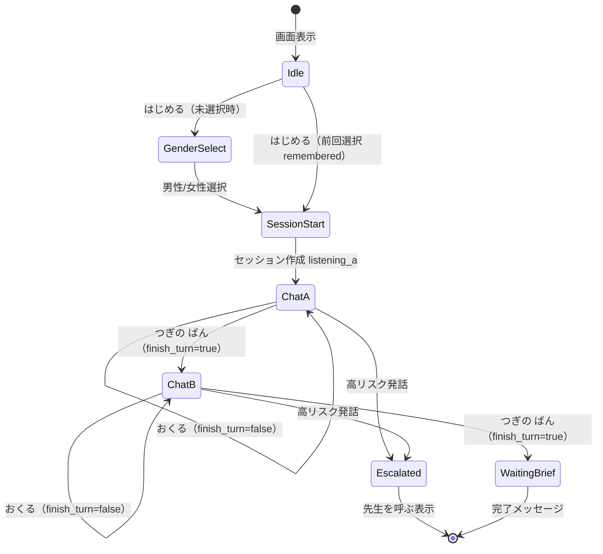
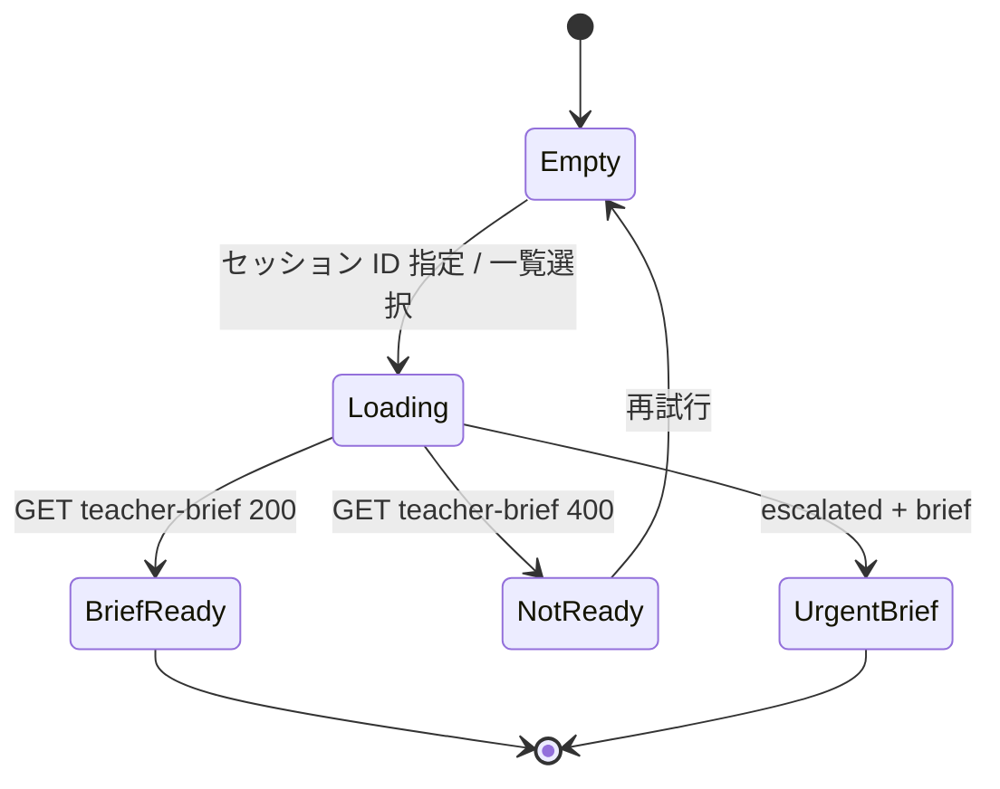

# 画面一覧・状態遷移 — unit-web-ui

## ルート構成

| パス | 画面 | ペルソナ | 主担当 |
|------|------|----------|--------|
| `/` | ホーム | 共通 | AppShell |
| `/child` | 子ども会話 | 子ども | ChildView + AvatarCanvas |
| `/child/setup` | アバター選択（任意） | 子ども | AvatarGenderPicker |
| `/teacher` | 先生ダッシュボード | 先生 | TeacherView |
| `/demo` | 消しゴムデモガイド | デモ | DemoGuideFlow |

## 子ども画面（`/child`）状態遷移

### 画面状態と UI

| 状態 | 表示 | 非表示にするもの |
|------|------|------------------|
| Idle | 「はじめる」、やさしい説明（`child-copy.ts`） | セッション ID |
| GenderSelect | おんな/おとこの ロボット選択 | 技術詳細 |
| ChatA / ChatB | 大きな吹き出し・大 VRM・順番プログレス・**おくる** / **つぎの ばん** | 裁き・勝敗 UI |
| LipSync | VRM 口パク + typing indicator | — |
| Escalated | 穏やかな全画面「先生を呼ぶね」 | 通常チャット入力 |

## 先生画面（`/teacher`）状態遷移

### 現行 gap → 改善

| 現行（モック） | 改善後 |
|----------------|--------|
| セッション ID 手入力のみ | **進行中セッション一覧**（5s 更新）+ 詳細折りたたみ ID 入力 |
| プレーン `
` 羅列 | BriefCard（facts / feelings / unknowns 分離） |
| disclaimer 1 ブロック | sticky AiDisclaimerBanner |
| エスカレーション弱い | UrgentBriefLayout（オレンジ枠 + アイコン） |

## デモフロー（消しゴム）

`docs/demo-scenario.md` に沿った `/demo` ガイド:

1. 子ども A 端末 → `/child`（男性 or 女性アバター選択可）
2. シナリオ文言プリセット or ガイド吹き出し
3. 子ども B 端末 → 別ブラウザ `/child`
4. 先生 → `/teacher` でブリーフ確認

## US トレース

| Story | 画面要件 |
|-------|----------|
| US-01 | 順番プログレス、別チャネル（A/B）、supportive トーン |
| US-04 | 1 枚ブリーフ、タイムライン、提案質問 |
| US-05 | EscalatedOverlay、Teacher urgent 表示 |
| US-06 | セッション一覧 ✅ ENH-UI-02 |

## レスポンシブ

| ブレークポイント | 子どもレイアウト |
|------------------|------------------|
| `md+`（768px〜） | Q3-A: 左アバター + 右チャット |
| `< md` | 上アバター（高さ ~280px）+ 下チャット |

## API 連携

| 操作 | エンドポイント | 画面 |
|------|----------------|------|
| セッション作成 | POST `/v1/sessions` | ChildView |
| ターン | POST `/v1/sessions/:id/child-turn`（`finish_turn` 任意） | ChildView |
| 一覧 | GET `/v1/sessions` | TeacherView |
| 途中経過 | GET `/v1/sessions/:id/progress` | TeacherView |
| ブリーフ | GET `/v1/sessions/:id/teacher-brief` | TeacherView |
