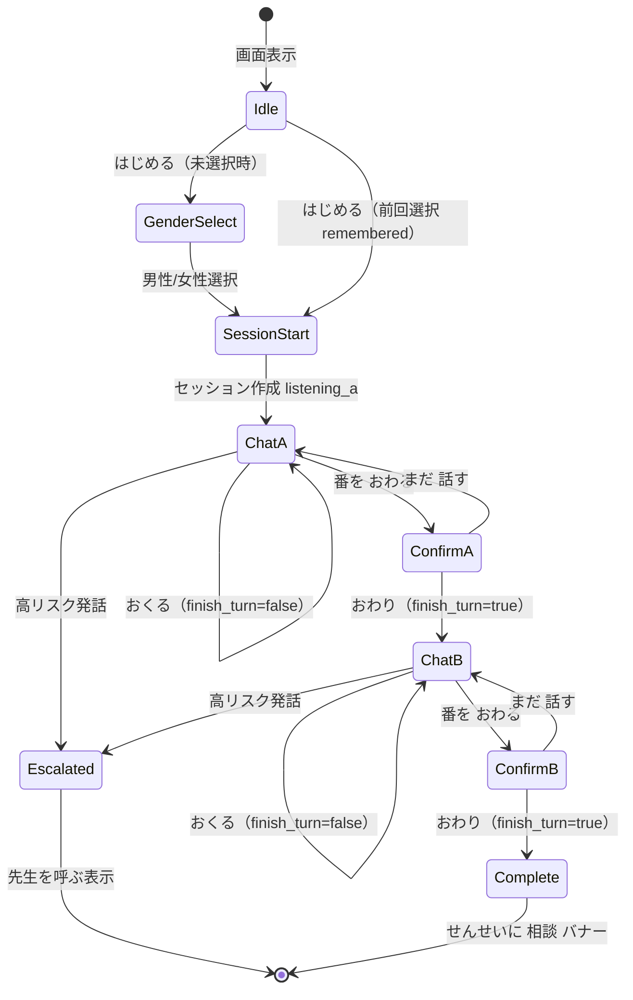
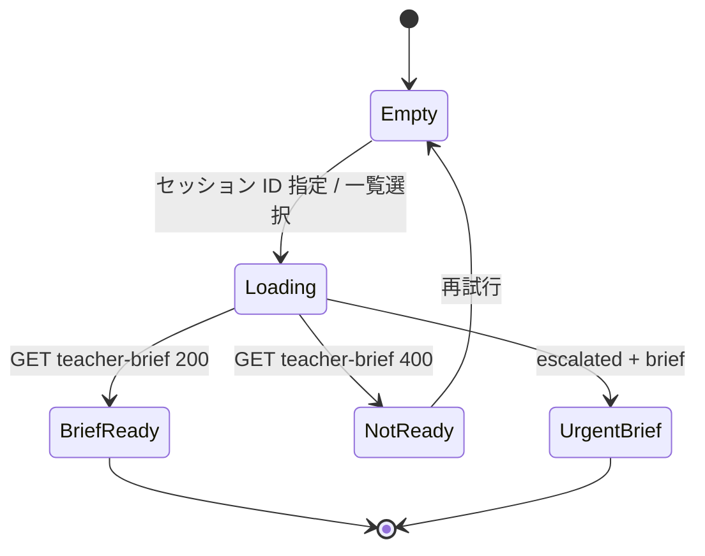

# 画面一覧・状態遷移 — unit-web-ui

## ルート構成

| パス | 画面 | ペルソナ | 主担当 |
|------|------|----------|--------|
| `/` | ホーム | 共通 | AppShell |
| `/child` | 子ども会話 | 子ども | ChildView + AvatarCanvas |
| `/child/setup` | アバター選択（任意） | 子ども | AvatarGenderPicker |
| `/teacher` | 先生ダッシュボード | 先生 | TeacherView |
| `/demo` | 消しゴムデモガイド | デモ | DemoGuideFlow |

## 子ども画面（`/child`）状態遷移

### 画面状態と UI

| 状態 | 表示 | 非表示にするもの |
|------|------|------------------|
| Idle | 「はじめる」、やさしい説明（`child-copy.ts`） | セッション ID |
| GenderSelect | おんな/おとこの ロボット選択 | 技術詳細 |
| ChatA / ChatB | 大きな吹き出し（**A=水色 / B=紫**）・VRM・順番プログレス・**おくる** / **番を おわる**・**会話のみスクロール** | 裁き・勝敗 UI |
| ConfirmFinish | 「もう おわって いい？」— **おわり** / **まだ 話す** | 通常入力 |
| Complete | 「せんせいに 相談してね」バナー（B 終了後） | チャット入力 |
| LipSync | VRM 口パク + typing indicator | — |
| NameTurn | 初回発話で名前 → ナカナオリが「〇〇さん」と呼ぶ | — |
| Escalated | 穏やかな全画面「先生を呼ぶね」 | 通常チャット入力 |

## 先生画面（`/teacher`）状態遷移

### 現行 gap → 改善

| 現行（モック） | 改善後 |
|----------------|--------|
| セッション ID 手入力のみ | **進行中セッション一覧**（5s 更新）+ 詳細折りたたみ ID 入力 |
| プレーン `
` 羅列 | BriefCard（facts / feelings / unknowns 分離） |
| disclaimer 1 ブロック | sticky AiDisclaimerBanner |
| エスカレーション弱い | UrgentBriefLayout（オレンジ枠 + アイコン） |
| 整理が抽象的 | **ConfirmationGuidePanel**（確認の進め方ヒーロー）+ LLM `teacher_hints` |
| 途中経過なし | GET `/progress` + `insights`（LLM、キャッシュ付き） |

### 先生画面レイアウト（ENH-UI-04）

1. **確認の進め方** — 番号付きステップ（コア価値）
2. 話の整理（食い違い・一致・不明）
3. 会話履歴
4. ブリーフ完成時: 事実・気持ちの整理

## デモフロー（消しゴム）

**台本（推奨）**: [docs/examples/eraser-story-dialogue.md](../../../../docs/examples/eraser-story-dialogue.md)  
**フロー詳細**: [docs/examples/child-conversation-flow.md](../../../../docs/examples/child-conversation-flow.md)  
**送信単位**: 各子 **名前 → 2回まとめ送信 → 番を おわる → おわり**（細切れ送信は非推奨）

`docs/demo-scenario.md` に沿ったフロー:

1. 子ども A 端末 → `/child`（男性 or 女性アバター選択可）
2. 台本どおり入力（`turns.recommended` in JSON）
3. 子ども B 端末 → 別ブラウザ `/child` または同一端末で B の番
4. 先生 → `/teacher` で **確認の進め方** + 会話履歴を確認

## US トレース

| Story | 画面要件 |
|-------|----------|
| US-01 | 順番プログレス、別チャネル（A/B）、supportive トーン |
| US-04 | 1 枚ブリーフ、タイムライン、提案質問 |
| US-05 | EscalatedOverlay、Teacher urgent 表示 |
| US-06 | セッション一覧 ✅ ENH-UI-02 |

## レスポンシブ

| ブレークポイント | 子どもレイアウト |
|------------------|------------------|
| `lg+`（1024px〜） | 左アバター（48%）+ 右チャット；ながれは常時表示 |
| `< lg` | 上アバター + 下チャット；子ども 2 発話後はながれ折りたたみ + アバター縮小 |

VRM はレイアウト変更時に `resetLayout` で aspect と読込時カメラ位置を復元（[vrm-integration.md](./vrm-integration.md)）。

## API 連携

| 操作 | エンドポイント | 画面 |
|------|----------------|------|
| セッション作成 | POST `/v1/sessions` | ChildView |
| ターン | POST `/v1/sessions/:id/child-turn`（`finish_turn` 任意） | ChildView |
| 一覧 | GET `/v1/sessions` | TeacherView |
| 途中経過 | GET `/v1/sessions/:id/progress`（`insights` LLM） | TeacherView |
| ブリーフ | GET `/v1/sessions/:id/teacher-brief` | TeacherView |
