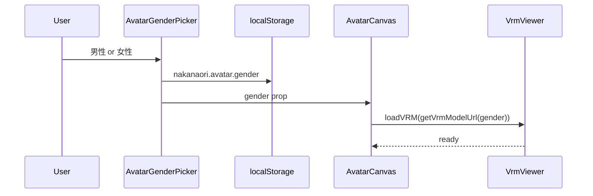

# VRM 統合設計 — unit-web-ui

## 概要

CharaTomo-Web の `VRMViewer`（`src/static/js/vrm-viewer.js`）を TypeScript + React に移植する。モデルは **CharaTomo 既存 GLB/VRM を流用**し、**男性 / 女性を UI で選択**する（Functional Design Q2 確定）。

## 依存ライブラリ

| パッケージ | 用途 |
|------------|------|
| `three` | WebGL シーン |
| `@pixiv/three-vrm` | `VRMLoaderPlugin` |
| `three/examples/jsm/loaders/GLTFLoader.js` | GLB 読込 |

CharaTomo-Web と同一メジャー系を揃える（Code Generation 時にバージョン固定）。

## モデル設定（CharaTomo 流用）

`character-manager.js` の `getVRMModelUrl()` と同じマッピング:

| 性別 | ファイル | 配置（Nakanaori） |
|------|----------|-------------------|
| `male` | `8329890252317737768.glb` | `public/models/8329890252317737768.glb` |
| `female` | `8590256991748008892.glb` | `public/models/8590256991748008892.glb` |

```typescript
// src/avatar/model-config.ts（設計）
export type AvatarGender = "male" | "female";

export const VRM_MODELS: Record<AvatarGender, string> = {
  male: "/models/8329890252317737768.glb",
  female: "/models/8590256991748008892.glb",
};

export function getVrmModelUrl(gender: AvatarGender): string {
  return VRM_MODELS[gender];
}
```

**資産取得**: CharaTomo-Web の `static/models/` からコピー（ライセンス・利用範囲はプロジェクト内で確認）。

```bash
npm run setup:vrm-models   # scripts/setup-vrm-models.sh
```

`dev-stack.sh` は GLB 欠落時に自動実行。**未配置時**は Vite が `/models/*.glb` に HTML を返し 3D 読込失敗 → 2D フォールバック（`public/models/README.md` 参照）。

## クラス設計: VrmViewer.ts

CharaTomo `VRMViewer` から移植する公開 API:

| メソッド | 説明 |
|----------|------|
| `constructor(canvas, options)` | width, height, background |
| `init()` | scene / camera / renderer |
| `loadVRM(url)` | GLB 読込 + VRM  humanoid |
| `startLipSync()` | 応答中の口パク |
| `stopLipSync()` | 停止 |
| `dispose()` | リソース解放 |

内部（CharaTomo 同様 — **ENH-UI-01 で実装済み**）:

- **自然腕ポーズ**: `setNaturalArmPose` / `maintainArmPose`（upperArm Z ±π/2）
- **idle**: `updateIdleAnimation` → 首 Y/Z の sin 波（モデル全体は回転しない）
- **瞬き**: `updateBlink` → `expressionManager` の `blink`
- **SpringBone warmup**: 読込時 90 フレーム先送り（髪逆立ち抑制）
- **ライティング**: 暖色 ambient + key + fill + rim（詳細は下記）
- **LookAt**: `autoUpdate = false`、目ボーン quaternion 固定
- **lip-sync**: 応答中 `aa` 表情
- `loadedUrl` で同一 URL 再読込スキップ
- `loading` フラグで重複防止
- `MAX_DELTA = 0.1` でタブ復帰時の delta スパイク抑制

> 詳細: [enhancements/vrm-quality/implementation-summary.md](../enhancements/vrm-quality/implementation-summary.md)

## React フック: useVrmAvatar

```typescript
function useVrmAvatar(
  canvasRef: RefObject<HTMLCanvasElement>,
  gender: AvatarGender,
  speaking: boolean,
): { ready: boolean; fallback: boolean };
```

| 責務 | 内容 |
|------|------|
| 初期化 | mount 時 WebGL チェック → `VrmViewer.init()` |
| gender 変更 | `loadVRM(getVrmModelUrl(gender))` — CharaTomo `reloadVRMModel` 相当 |
| speaking | `true` → `startLipSync()`, `false` → `stopLipSync()` |
| cleanup | unmount → `dispose()` |
| fallback | WebGL 不可 → `{ fallback: true }`、2D 画像表示 |

## AvatarCanvas コンポーネント

```text
┌─────────────────────┐
│  <canvas />         │  ← VRM（WebGL OK）
│  or                 │
│     │  ← WebGL NG
└─────────────────────┘
```

- 子ども画面左カラム（Q3-A）
- サイズ: 320×320（md+）、200 高（mobile）

## 男女選択フロー



- 初回: GenderSelect ステップ表示（screen-inventory 参照）
- 2 回目以降: LS から復元、設定から変更可

## ChildView との連携

| イベント | VRM 動作 |
|----------|----------|
| セッション開始 | idle 開始 |
| `postChildTurn` 送信前 | — |
| 応答受信 `agent_message` | `speaking=true` → lip-sync |
| 応答表示完了（タイマー 2s） | `speaking=false` |
| エスカレーション | idle 維持、穏やか表情 |

## WebGL フォールバック

CharaTomo `character-manager.js` パターン:

1. `checkWebGLSupport()` — canvas で試描画
2. 不可 → `isVrmEnabled = false`
3. UI: 男女別 2D プレースホルダ PNG（`public/images/avatar-male.png`, `avatar-female.png`）

## パフォーマンス（NFR へ引継ぎ）

- モデル 1 体のみロード（男女切替時 dispose + reload）
- `requestAnimationFrame` は表示中タブのみ（CharaTomo `visibilitychange` パターン）
- 先生画面には VRM なし（帯域・CPU 節約）

## テスト

| 種別 | 内容 |
|------|------|
| ユニット | `getVrmModelUrl('male'|'female')` |
| E2E | GenderPicker 表示 → 選択 → canvas or fallback 存在 |
| 手動 | 男女切替でモデル変更、応答時 lip-sync |

## Kebbi との関係

- Web VRM は **画面内アバター**；Kebbi は物理ロボット
- 同一 API 応答（`agent_message`）を両方が消費
- 男女選択は Web ローカル（Kebbi 側キャラ設定は sibling repo で別管理）

---

## Enhancement ENH-UI-01 — VRM 品質・表示修正（2026-06-21）

初回 Code Generation 後の polish。要件: [enhancements/vrm-quality/requirements.md](../enhancements/vrm-quality/requirements.md)

### 解決した問題

| 問題 | 対策 |
|------|------|
| GLB 未配置で 3D 非表示 | `setup-vrm-models.sh` + dev-stack 自動コピー |
| T ポーズ | `maintainArmPose()` 毎フレーム |
| 髪逆立ち | `warmupSpringBones()` 90f + loading オーバーレイ |
| idle / 瞬きなし | CharaTomo 同等の首 idle + blink |
| 暗い | 4 灯ライティング（ambient 0.55, key 1.0） |

### レンダーループ（確定）

`updateIdleAnimation` → lip-sync → `vrm.update` → `fixEyeBones` → `maintainArmPose` → `lockTransform` → `updateSmoothNeckMovement` → `updateBlink` → render

### ローディング UX

`useVrmAvatar` は `loadVRM()` 完了（warmup 含む）まで `loading: true`。`AvatarCanvas` は「3Dモデル読み込み中…」オーバーレイを表示。
