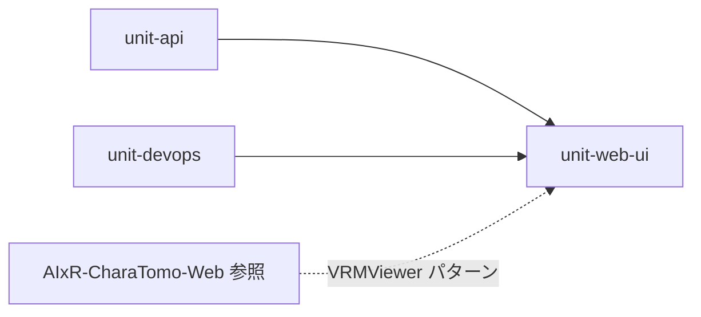

# unit-web-ui — UI/UX ブラッシュアップ + VRM アバター

## 概要

| 項目 | 内容 |
|------|------|
| **Unit ID** | `unit-web-ui` |
| **名称** | Web UI / UX + VRM Avatar |
| **リポジトリパス** | `services/web/`（`src/components/`, `src/avatar/`, `src/theme/`） |
| **デプロイ** | Cloud Run `nakanaori-web`（既存 Vite ビルドに含む） |
| **優先度** | P0（ハッカソンデモの見せ場） |
| **参照実装** | `AIxR-CharaTomo-Web` — `/Users/maemoto/Documents/GitHub/AIxR-CharaTomo-Web/src/static/js/vrm-viewer.js` |

## 背景

`unit-web-teacher` / `unit-web-child` は API 連携済みの**機能モック**段階。本ユニットはデザインシステム・VRM 黒子アバター・デモ品質 UX を一括で担う。

## スコープ

### 含む

1. **デザインシステム** — トークン（色・字・余白）、共通コンポーネント（Button, Card, ChatBubble, BriefSection）
2. **VRM アバター** — Three.js + `@pixiv/three-vrm` による黒子ロボット表示（CharaTomo-Web と同系）
3. **子ども UI** — チャット + アバター、順番プログレス、エスカレーション画面
4. **先生 UI** — 1 枚ブリーフ、facts / feelings / unknowns 分離、`ai_disclaimer` 常時表示
5. **デモモード** — `docs/demo-scenario.md`（消しゴム）のガイド付きフロー
6. **フォールバック** — WebGL 非対応時は静止画 / 2D イラスト（CharaTomo の 2D/3D 切替と同様）

### 含まない

- API / エージェントロジック変更（`unit-api`, `unit-agent-core`）
- Kebbi 実機（`unit-kebbi-contract`）— VRM モデル資産は共有可能
- STT/TTS（Phase 2）
- Firebase Auth

## VRM 技術方針（CharaTomo-Web 準拠）

CharaTomo-Web の `VRMViewer` を React 向けに移植する。

| レイヤ | 技術 | 備考 |
|--------|------|------|
| 3D ランタイム | `three` | r15x 系 |
| VRM 読込 | `@pixiv/three-vrm` + `GLTFLoader` | CharaTomo と同一スタック |
| React 統合 | `<canvas ref>` + `useEffect` / カスタムフック `useVrmAvatar` | ライフサイクルで dispose |
| アニメーション | idle（首・瞬き）+ 応答時 lip-sync 風 | `agent_message` 表示と同期 |
| モデル | CharaTomo 既存 GLB 流用 `public/models/` | **男性 / 女性を UI 選択**（Q2 確定） |
| 非 WebGL | 2D フォールバック画像 | `character-manager.js` の `isVrmEnabled` パターン |

### CharaTomo-Web からの移植マッピング

| CharaTomo-Web | Nakanaori `services/web` |
|---------------|--------------------------|
| `vrm-viewer.js` → `VRMViewer` クラス | `src/avatar/VrmViewer.ts` |
| `character-manager.js` → 初期化・reload | `src/avatar/useVrmAvatar.ts` |
| `<canvas class="character-vrm-viewer">` | `<AvatarCanvas />` コンポーネント |
| 口パク / idle | ロボット応答中のみ lip-sync トリガ |

## ペルソナ別 UX 原則

### 子ども（`/child`）

- 温かいトーン、大きめタップ領域、セッション ID 非表示
- ロボットは**黒子** — 目立ちすぎず、話を聞く存在（VRM は画面左 or 上部）
- 裁きを示唆する UI 禁止（勝敗色、❌/✅ 対比）

### 先生（`/teacher`）

- 情報スキャン優先、1 枚ブリーフ
- facts / feelings / unknowns を色分けカード
- `urgent` エスカレーションはオレンジ枠 + 固定バナー
- `ai_disclaimer` は折りたたまない

## 依存関係



- **依存**: `unit-api`（REST）、`unit-devops`（web デプロイ）
- **参照のみ**: AIxR-CharaTomo-Web（コードコピーではなくパターン移植）

## 既存ユニットとの関係

| ユニット | 関係 |
|----------|------|
| `unit-web-child` | 子ども**機能**（child-turn 連携）— UI 表現は本ユニットが提供 |
| `unit-web-teacher` | 先生**機能**（teacher-brief 連携）— UI 表現は本ユニットが提供 |
| `unit-kebbi-contract` | 物理ロボット経路；Web VRM とトーン・キャラクター設計を揃える |

Construction では **unit-web-ui を先に design system + VRM 基盤** → teacher / child 画面へ適用。

## 受け入れ基準（MVP）

- [x] VRM アバターが `/child` に表示され、**男性/女性モデル選択**可能
- [x] WebGL 非対応時 2D フォールバック
- [x] ロボット応答表示時に idle / lip-sync が動作
- [x] 自然な立ち姿・瞬き・首 idle（ENH-UI-01）
- [x] SpringBone warmup で表示直後の髪逆立ち抑制（ENH-UI-01）
- [x] 子どもチャットが吹き出し UI + 順番プログレス
- [x] 先生ブリーフが facts / feelings / unknowns 分離カード + disclaimer 固定
- [ ] 消しゴムデモシナリオを UI 上で完走可能
- [x] `scripts/verify-browser.mjs` が UI 要素を検証（既存テスト拡張）

## Enhancement 履歴

| ID | 内容 | 状態 |
|----|------|------|
| ENH-UI-01 | VRM 品質・表示修正（ポーズ / idle / 瞬き / ライト / GLB setup） | ✅ [enhancements/vrm-quality/](./enhancements/vrm-quality/requirements.md) |
| ENH-UI-02 | 子ども大 UI + 低学年文言 / 先生進行中セッション一覧 | ✅ [enhancements/child-teacher-demo/](./enhancements/child-teacher-demo/requirements.md) |
| ENH-UI-03 | IME 対応 / 複数発話 + つぎの番 / Gemini 2.5 / .env | ✅ [enhancements/chat-gemini-local/](./enhancements/chat-gemini-local/requirements.md) |

## Construction 予定ステージ

1. Functional Design — 画面一覧、コンポーネント、VRM ライフサイクル ✅
2. NFR Requirements — 性能（モバイル WebGL）、バンドルサイズ、a11y 最低限 ✅
3. Code Generation — design tokens → AvatarCanvas → ChildView / TeacherView リデザイン ✅
4. Enhancement ENH-UI-01 — VRM 品質・表示修正 ✅
5. Enhancement ENH-UI-02 — 子ども大 UI + 先生デモセッション一覧 ✅
6. Enhancement ENH-UI-03 — チャット UX + ローカル Gemini ✅

## npm 依存（予定）

```json
{
  "three": "^0.17x",
  "@pixiv/three-vrm": "^3.x",
  "@types/three": "..."
}
```

Tailwind CSS + shadcn/ui — Functional Design で確定（Q1=A）。
