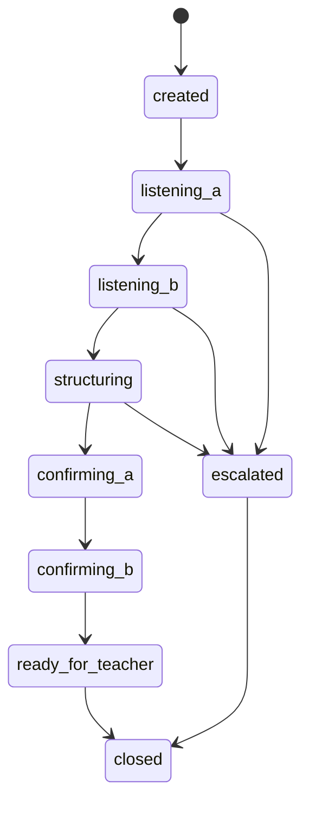

# Application Design — 統合版

## 概要

Nakanaori Agent は GCP 上で動作するマルチエージェント仲介システムです。子どもは Web アバターまたは Kebbi ロボットと対話し、先生はダッシュボードで構造化ブリーフを受け取ります。AI は裁き手ではなく、黒子（裏方サポーター）として振る舞います。

## アーキテクチャサマリー

個別成果物を参照:

- [components.md](./components.md)
- [component-methods.md](./component-methods.md)
- [services.md](./services.md)
- [component-dependency.md](./component-dependency.md)

## セッション状態マシン

## 技術スタック

| レイヤー | 技術 |
|----------|------|
| エージェント | Google ADK + Gemini API |
| API | Python FastAPI on Cloud Run |
| Web | Vite + React on Cloud Run |
| セッション | in-memory MVP（Firestore は後回し） |
| Gemini | 全エージェント `gemini-2.0-flash` |
| Web パッケージング | 単一 Vite アプリ（`/teacher`, `/child` ルート） |
| CI/CD | GitHub Actions |
| デモクライアント | Web（先生 + 子ども）と Kebbi — 同一優先度 |

## 倫理制約（設計レベル）

- スキーマに裁きフィールドを含めない
- TeacherBrief には常に `ai_disclaimer` を含める
- エスカレーション時は通常の仲介完了をバイパス
- プロンプトはバージョン管理し CI でチェック

## 作業ユニット（Construction 向け）

[unit-of-work.md](./unit-of-work.md)、[unit-of-work-dependency.md](./unit-of-work-dependency.md)、[unit-of-work-story-map.md](./unit-of-work-story-map.md) を参照。

1. unit-agent-core
2. unit-api
3. unit-web-teacher
4. unit-web-child
5. unit-devops
6. unit-kebbi-contract
