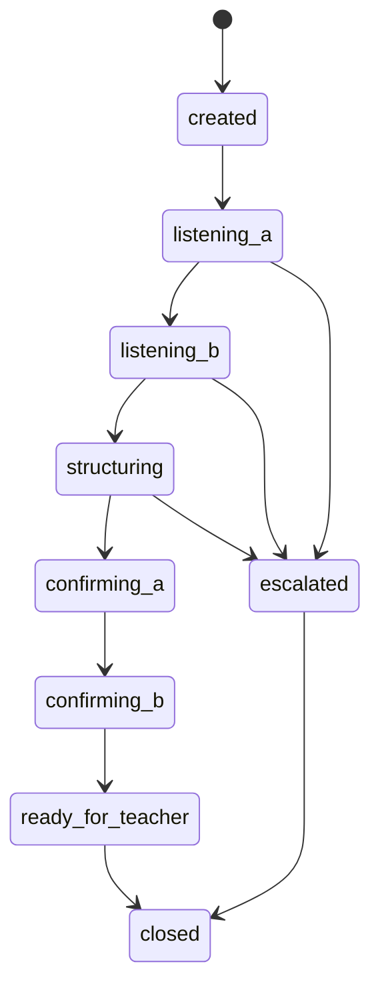

# Application Design — Consolidated

## Overview

Nakanaori Agent is a GCP-hosted multi-agent mediation system. Children interact via Web avatar or Kebbi robot; teachers receive structured briefs via a dashboard. The AI acts as kuroko (backstage supporter), never as judge.

## Architecture Summary

See individual artifacts:

- [components.md](./components.md)
- [component-methods.md](./component-methods.md)
- [services.md](./services.md)
- [component-dependency.md](./component-dependency.md)

## Session State Machine

## Technology Stack

| Layer | Technology |
|-------|------------|
| Agents | Google ADK + Gemini API |
| API | Python FastAPI on Cloud Run |
| Web | Vite + React on Cloud Run |
| Session | Firestore (or in-memory MVP) |
| CI/CD | GitHub Actions |

## Ethics Constraints (Design-Level)

- No judgment fields in schemas
- TeacherBrief always includes `ai_disclaimer`
- Escalation bypasses normal mediation completion
- Prompts versioned and CI-checked

## Units of Work (for Construction)

1. unit-agent-core
2. unit-api
3. unit-web-teacher
4. unit-web-child
5. unit-devops
6. unit-kebbi-contract
