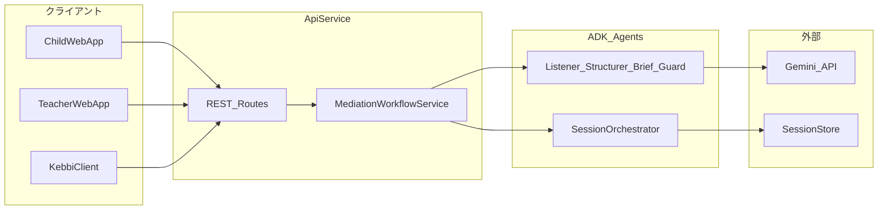

# コンポーネント依存関係

## 依存関係マトリクス

| From | To | 関係 |
|------|-----|------|
| ChildWebApp | ApiService | HTTP REST |
| TeacherWebApp | ApiService | HTTP REST |
| KebbiClient | ApiService | HTTP REST（sibling repo） |
| ApiService | MediationWorkflowService | 内部 |
| MediationWorkflowService | SessionOrchestrator | 内部 |
| MediationWorkflowService | ADK Agents | エージェント呼び出し |
| SessionOrchestrator | SessionStore | 読み書き |
| ADK Agents | Gemini API | LLM 推論 |
| EmotionGuardAgent | MediationWorkflowService | エスカレーション信号 |
| TeacherBriefAgent | BriefDeliveryService | ブリーフ保存 |

## 通信パターン

## データフロー

1. **子どもターン**: Client → POST child-turn → Workflow → Guard → Listener → Store
2. **整理**: 双方完了 → Structurer → 構造化事実を Store
3. **確認**: 子どもごと Confirmation → 訂正 → Structurer merge
4. **ブリーフ**: TeacherBrief → Store → GET teacher-brief → 先生 UI
5. **エスカレーション**: Guard 発火 → escalate 状態 → エスカレーションブリーフ → 先生 UI

## Kebbi 境界

- KebbiClient は**このリポジトリに含まれない**
- 契約は `clients/kebbi/api-contract.md` で定義
- 参照実装: `AIxR-CharaTomo-Kebbi`（CharaTomo chat フローのコピーは不可）
