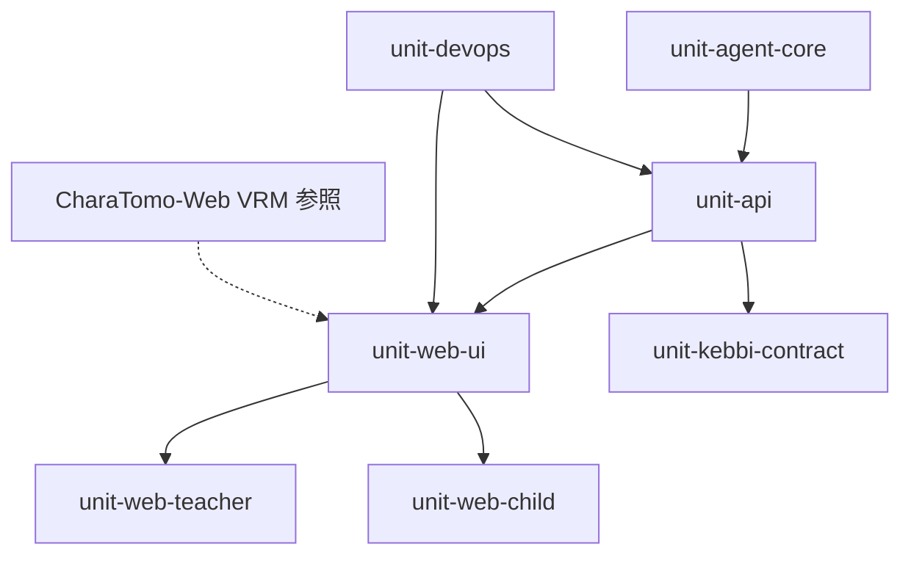

# ユニット依存関係マトリクス

## 直接依存

| ユニット | 依存先 | 依存種別 |
|----------|--------|----------|
| unit-api | unit-agent-core | npm workspace import（`@nakanaori/agents`） |
| unit-web-teacher | unit-api, unit-web-ui | HTTP REST；UI コンポーネント |
| unit-web-child | unit-api, unit-web-ui | HTTP REST；VRM + UI コンポーネント |
| unit-web-ui | unit-api | HTTP REST（機能連携）；CharaTomo-Web 参照（VRM パターン） |
| unit-kebbi-contract | unit-api | HTTP REST（契約が API ルートと一致） |
| unit-devops | unit-api, unit-web-* | Docker ビルド + デプロイ対象 |
| unit-agent-core | — | なし（リーフライブラリ） |

## 依存関係グラフ

## 外部依存

| ユニット | 外部システム | 備考 |
|----------|--------------|------|
| unit-agent-core | Gemini API via ADK | `GEMINI_API_KEY` |
| unit-api | Cloud Run | `asia-northeast1` |
| unit-devops | GCP（Artifact Registry, Secret Manager, Cloud Run） | GitHub Actions secrets |
| unit-kebbi-contract | AIxR-CharaTomo-Kebbi（sibling repo） | Android クライアントは monorepo 外 |
| unit-web-teacher | — | 静的 SPA + nginx |
| unit-web-child | — | 静的 SPA + nginx |
| unit-web-ui | Three.js, @pixiv/three-vrm | CharaTomo-Web 同系 VRM；WebGL フォールバック |

## 並行化ルール

`unit-api` が staging 対応後:

- **トラック A**: `unit-web-ui`（デザイン + VRM）→ `unit-web-teacher` + `unit-web-child`
- **トラック B**: `unit-kebbi-contract`（契約凍結 + sibling repo 実装）

トラック A と B は**互いにブロックしない**；両方とも安定 API 契約のみに依存。

## バージョン / 契約カップリング

| 契約面 | 所有ユニット | 利用者 |
|--------|--------------|--------|
| REST `/v1/sessions/*` | unit-api | web-teacher, web-child, kebbi-contract |
| `TeacherBrief` スキーマ | unit-agent-core | unit-api, unit-web-teacher |
| `clients/kebbi/api-contract.md` | unit-kebbi-contract | sibling Kebbi repo |

API の破壊的変更は web クライアントと Kebbi 契約の協調更新が必要。

## デプロイ依存

| サービス | Cloud Run 名 | ビルド元 | デプロイ担当 |
|----------|--------------|----------|--------------|
| API | `nakanaori-api` | `services/api/Dockerfile` | unit-devops |
| Web | `nakanaori-web` | `services/web/Dockerfile` | unit-devops |

Web コンテナには先生・子ども両ルートを含む（単一 Vite ビルド）。
