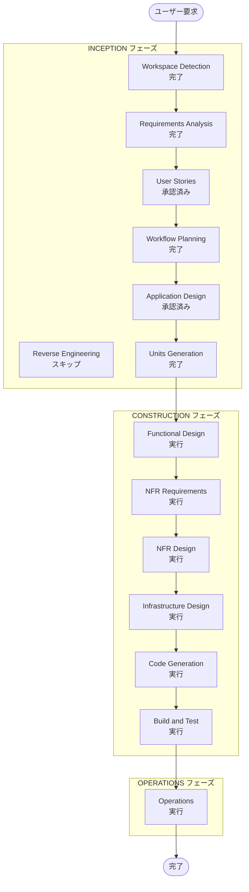

# 実行計画

## 詳細分析サマリー

### プロジェクト種別

- Nakanaori Agent の **Greenfield** monorepo
- **ハッカソン**: DevOps × AI Agent Hackathon 2026（提出 2026-07-10）

### 変更影響評価

- **ユーザー向け変更**: あり — 新規の子ども・先生 UI
- **構造変更**: あり — GCP 上の新規マルチエージェントシステム
- **データモデル変更**: あり — セッション、子どもターン、構造化事実、先生ブリーフ
- **API 変更**: あり — 新規 REST API（`/v1/sessions/*`）
- **NFR 影響**: あり — 児童安全、保持、Cloud Run、CI/CD

### リスク評価

- **リスクレベル**: 中（期限が短い、マルチエージェント複雑性、Kebbi は sibling repo）
- **ロールバック**: 容易（Cloud Run リビジョン）
- **テスト**: 中程度（エージェント出力検証、プロンプト CI）

## ワークフロー可視化

## 実行するフェーズ

### INCEPTION フェーズ

- [x] Workspace Detection — 完了（greenfield）
- [x] Reverse Engineering — スキップ（greenfield）
- [x] Requirements Analysis — 完了（検証質問回答済み）
- [x] User Stories — 承認済み
- [x] Workflow Planning — 完了
- [x] Application Design — 承認済み
- [x] Units Generation — 完了

### CONSTRUCTION フェーズ

- [ ] Functional Design — 実行
  - **理由**: エージェントと API のユニット別ビジネスロジック
- [ ] NFR Requirements — 実行
  - **理由**: 児童安全、保持、ハッカソン GCP 要件
- [ ] NFR Design — 実行
  - **理由**: ログ、プロンプト CI、Cloud Run 設定
- [ ] Infrastructure Design — 実行
  - **理由**: Cloud Run、GitHub Actions、環境シークレット
- [ ] Code Generation — 実行
  - **理由**: コア成果物
- [ ] Build and Test — 実行
  - **理由**: CI、ユニットテスト、プロンプトチェック

### OPERATIONS フェーズ

- [ ] Operations — 実行
  - **理由**: ハッカソンデモ URL 向け staging デプロイ

## 作業ユニット

| Unit ID | 名称 | スコープ | 優先度 |
|---------|------|----------|--------|
| unit-agent-core | Agent Core | ADK オーケストレータ + エージェント + プロンプト | P0 |
| unit-api | API Service | FastAPI + Cloud Run | P0 |
| unit-devops | DevOps | CI/CD、プロンプトチェック、staging デプロイ | P0 |
| unit-web-teacher | Teacher Web | ダッシュボード + ブリーフ表示 | P0（デモ） |
| unit-web-child | Child Web | アバターチャット UI | P0（デモ） |
| unit-kebbi-contract | Kebbi Contract | api-contract.md + sibling repo 同期 | P0（デモ） |

## 推奨ビルド順序

1. unit-devops — CI 骨格 + staging デプロイ（API + web サービス）
2. unit-agent-core — ADK + Gemini マルチエージェントワークフロー
3. unit-api — REST でエージェントを公開（in-memory セッションストア）
4. **並行トラック A（Web デモ）:** unit-web-teacher + unit-web-child
5. **並行トラック B（Kebbi デモ）:** unit-kebbi-contract → sibling repo `NakanaoriApi.kt`

トラック A と B は同一 API を共有；どちらも後回しにしない。

## 見積もりタイムライン

- **総フェーズ数**: 11 実行 / 1 スキップ
- **ハッカソン期限**: 2026-07-10
- **MVP 目標**: 2026年7月初旬までに P0 ユニット

## 成功基準

- **主目標**: **Web UI と Kebbi ロボット**でデモ可能な仲介フロー：2人の子ども → 構造化ブリーフ → 先生ダッシュボード
- **主要成果物**: デプロイ済み Cloud Run URL（API + web）、Kebbi ライブデモ、公開 GitHub リポジトリ、Proto Pedia 登録
- **品質ゲート**: プロンプト CI 合格；裁きラベルなし；エスカレーション経路が動作
- **ハッカソン**: Gemini + ADK + Cloud Run を実証；リポジトリで DevOps サイクルが可視
