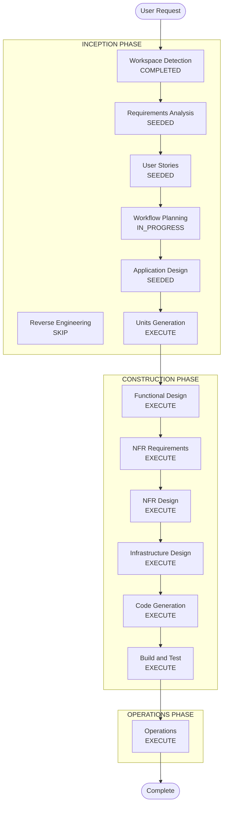

# Execution Plan

## Detailed Analysis Summary

### Project Type

- **Greenfield** monorepo for Nakanaori Agent
- **Hackathon**: DevOps × AI Agent Hackathon 2026 (submission 2026-07-10)

### Change Impact Assessment

- **User-facing changes**: Yes — new child and teacher UIs
- **Structural changes**: Yes — new multi-agent system on GCP
- **Data model changes**: Yes — session, child turns, structured facts, teacher brief
- **API changes**: Yes — new REST API (`/v1/sessions/*`)
- **NFR impact**: Yes — child safety, retention, Cloud Run, CI/CD

### Risk Assessment

- **Risk Level**: Medium (tight deadline, multi-agent complexity, Kebbi in sibling repo)
- **Rollback Complexity**: Easy (Cloud Run revisions)
- **Testing Complexity**: Moderate (agent output validation, prompt CI)

## Workflow Visualization

## Phases to Execute

### INCEPTION PHASE

- [x] Workspace Detection — COMPLETED (greenfield)
- [x] Reverse Engineering — SKIP (greenfield)
- [x] Requirements Analysis — SEEDED (verify questions pending)
- [x] User Stories — SEEDED (pending approval)
- [x] Workflow Planning — IN PROGRESS
- [x] Application Design — SEEDED (pending approval)
- [ ] Units Generation — EXECUTE
  - **Rationale**: Multiple parallel units (agent, api, web, devops, kebbi contract)

### CONSTRUCTION PHASE

- [ ] Functional Design — EXECUTE
  - **Rationale**: Per-unit business logic for agents and API
- [ ] NFR Requirements — EXECUTE
  - **Rationale**: Child safety, retention, hackathon GCP requirements
- [ ] NFR Design — EXECUTE
  - **Rationale**: Logging, prompt CI, Cloud Run config
- [ ] Infrastructure Design — EXECUTE
  - **Rationale**: Cloud Run, GitHub Actions, env secrets
- [ ] Code Generation — EXECUTE
  - **Rationale**: Core deliverable
- [ ] Build and Test — EXECUTE
  - **Rationale**: CI, unit tests, prompt checks

### OPERATIONS PHASE

- [ ] Operations — EXECUTE
  - **Rationale**: Staging deploy for hackathon demo URL

## Units of Work

| Unit ID | Name | Scope | Priority |
|---------|------|-------|----------|
| unit-agent-core | Agent Core | ADK orchestrator + agents + prompts | P0 |
| unit-api | API Service | FastAPI + Cloud Run | P0 |
| unit-devops | DevOps | CI/CD, prompt check, staging deploy | P0 |
| unit-web-teacher | Teacher Web | Dashboard + brief view | P1 |
| unit-web-child | Child Web | Avatar chat UI | P1 |
| unit-kebbi-contract | Kebbi Contract | api-contract.md only | P2 |

## Recommended Build Sequence

1. unit-devops (CI skeleton)
2. unit-agent-core (minimal loop: structurer + brief)
3. unit-api (expose agents via REST)
4. unit-web-teacher (demo brief view)
5. unit-web-child (text chat)
6. unit-kebbi-contract (finalize HTTP contract)

## Estimated Timeline

- **Total Phases**: 11 execute / 1 skip
- **Hackathon deadline**: 2026-07-10
- **MVP target**: P0 units by early July 2026

## Success Criteria

- **Primary Goal**: Demoable mediation flow: two children → structured brief → teacher dashboard
- **Key Deliverables**: Deployed Cloud Run URL, public GitHub repo, Proto Pedia entry
- **Quality Gates**: Prompt CI passes; no judgment labels; escalation path works
- **Hackathon**: Gemini + ADK + Cloud Run demonstrated; DevOps cycle visible in repo
