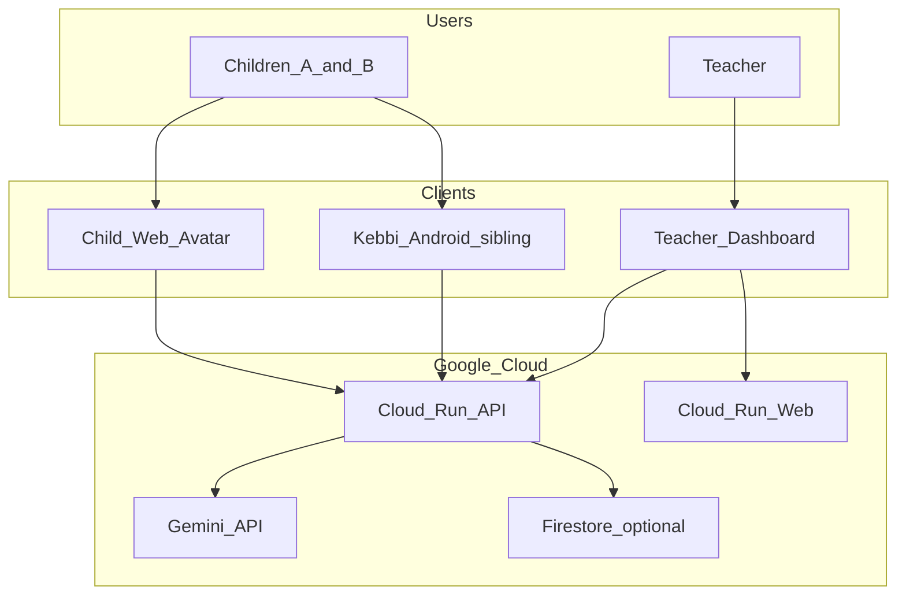

# Architecture

## Overview

Nakanaori Agent mediates minor school conflicts using a multi-agent ADK workflow on Google Cloud. Children talk to a Web avatar or Kebbi robot; teachers receive a structured, non-judgmental brief.

## System Context

## Repository Layout

| Path | Purpose |
|------|---------|
| `agents/nakanaori/` | ADK agents and prompts |
| `services/api/` | FastAPI REST service |
| `services/web/` | React teacher + child UI |
| `clients/kebbi/` | API contract (implementation external) |
| `aidlc-docs/` | AI-DLC Inception/Construction artifacts |
| `.aidlc-rule-details/` | AI-DLC workflow rules |
| `infrastructure/` | Cloud Run YAML, Terraform (future) |

## Agent Workflow

1. **ListenerAgent** — Hear each child separately
2. **EmotionGuardAgent** — Check for escalation on each turn
3. **FactStructurerAgent** — Build facts / feelings / unknowns
4. **ConfirmationAgent** — Read back and accept corrections
5. **TeacherBriefAgent** — Generate teacher report

Orchestrated by **SessionOrchestrator** with explicit state machine.

## Ethics

See `.cursor/rules/nakanaori-product.mdc` and `.aidlc-rule-details/extensions/child-safety/nakanaori/`.

## Related Docs

- [Demo scenario](./demo-scenario.md)
- [DevOps](./devops.md)
- [Hackathon submission](./hackathon-submission.md)
- [Kebbi API contract](../clients/kebbi/api-contract.md)
