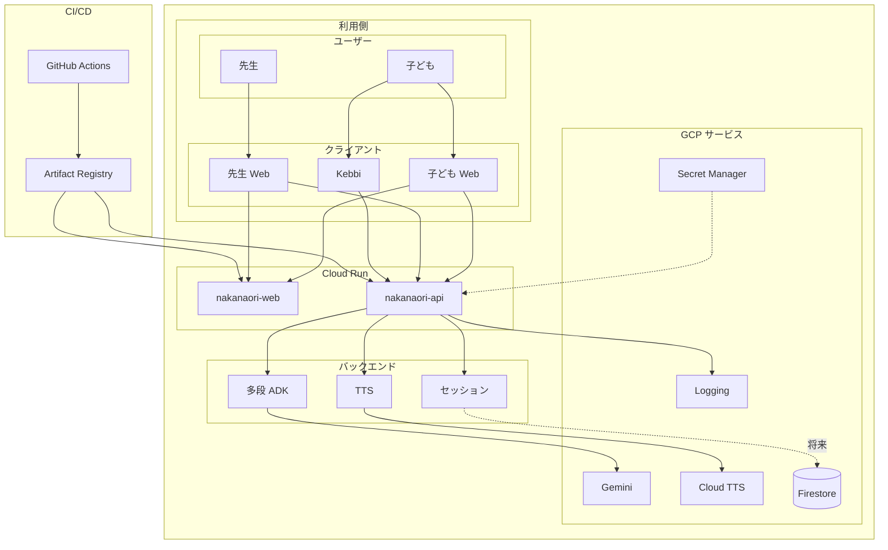
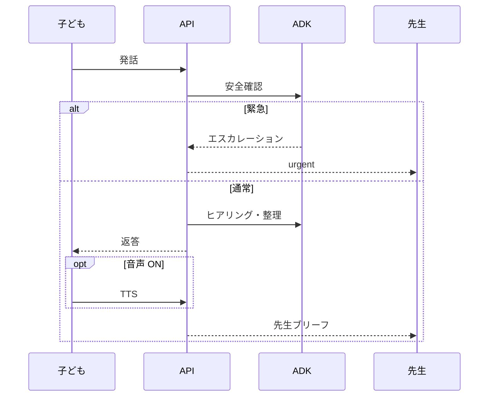
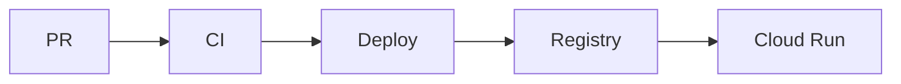

# アーキテクチャ

## 概要

Nakanaori Agent は **TypeScript モノレポ**上の **Google ADK 多段エージェント**と **Cloud Run** で、学校の小さないざこざを仲介します。子どもは Web（VRM アバター）または Kebbi ロボットと話し、先生は構造化された非裁断的ブリーフを受け取ります。

## システム構成図

ProtoPedia の「システム構成」画像は、この図を **880×495px** の PNG にエクスポートして使います（[proto-pedia-draft.md](./proto-pedia-draft.md) 参照）。

**図の方針**: ノードは役割名のみ（1行）。880×495 の横長に合わせ、左→右の流れで配置。詳細は [技術スタック一覧](#技術スタック一覧)。

## 技術スタック一覧

| レイヤ | 技術 | パス / 備考 |
|--------|------|-------------|
| **モノレポ** | npm workspaces · TypeScript 5 · Node.js 22 | ルート `package.json` |
| **エージェント** | Google ADK · Zod · Vitest | `packages/agents/` — Listener / EmotionGuard / FactStructurer / Confirmation / TeacherBrief |
| **TTS ライブラリ** | `@google-cloud/text-to-speech` | `packages/tts/` — API から共有利用 |
| **API** | Hono · `@hono/node-server` | `services/api/` — REST `/v1/*` |
| **Web** | React 19 · Vite 6 · React Router 7 · Tailwind CSS 4 | `services/web/` — `/child` · `/teacher` |
| **3D アバター** | Three.js · `@pixiv/three-vrm` | `services/web/` — 子ども UI |
| **Kebbi クライアント** | Android · Kotlin · Nuwa ASR | 別リポ `nakanaori-kebbi` — 契約: `clients/kebbi/api-contract.md` |
| **LLM** | Gemini API | Secret Manager 経由；未設定時 stub モード |
| **音声合成** | Google Cloud TTS（Chirp 3 HD） | `POST /v1/tts/synthesize`；Web / Kebbi 共通；Kebbi は 503 時 Nuwa TTS フォールバック |
| **セッション** | in-memory `Map` | `services/api/src/store.ts` — MVP；Firestore は将来 |
| **実行基盤** | Cloud Run × 2（`nakanaori-api` / `nakanaori-web`） | Docker · Artifact Registry |
| **秘密情報** | Secret Manager | `GEMINI_API_KEY` · `GOOGLE_TTS_CREDENTIALS_JSON` |
| **ログ** | 構造化 JSON → Cloud Logging | `services/api/src/logger.ts` |
| **CI/CD** | GitHub Actions | `ci.yml` · `deploy-staging.yml` — 詳細: [devops.md](./devops.md) |
| **E2E（任意）** | Playwright | ルート devDependency |

## リポジトリ構成

| パス | 目的 |
|------|------|
| `packages/agents/` | ADK エージェント（TypeScript） |
| `packages/tts/` | Google Cloud TTS ラッパー |
| `services/api/` | Hono REST サービス（Node.js） |
| `services/web/` | React 先生 + 子ども UI |
| `clients/kebbi/` | API 契約（実装は `nakanaori-kebbi`） |
| `aidlc-docs/` | AI-DLC Inception/Construction 成果物 |
| `.aidlc-rule-details/` | AI-DLC ワークフロールール |
| `infrastructure/` | Cloud Run YAML、Terraform（将来） |
| `.github/workflows/` | CI / staging デプロイ |

## エージェントワークフロー

1. **ListenerAgent** — 各子どもを個別にヒアリング
2. **EmotionGuardAgent** — 各ターンでエスカレーション確認
3. **FactStructurerAgent** — 事実 / 感情 / 不明点を構築
4. **ConfirmationAgent** — 読み返しと訂正受付
5. **TeacherBriefAgent** — 先生向けレポート生成

**SessionOrchestrator** が明示的な状態マシンでオーケストレーション。

## データフロー（1ターン）

## DevOps パイプライン

詳細: [devops.md](./devops.md)

## 倫理

`.cursor/rules/nakanaori-product.mdc` および `.aidlc-rule-details/extensions/child-safety/nakanaori/` を参照。

- AI の出力・保存データに「誰が悪い」「勝ち負け」等の判定項目を持たせない
- 暴力・いじめ等は AI が自律解決せず、先生へエスカレーション
- 先生ブリーフには `ai_disclaimer` を必ず付与

## 関連ドキュメント

- [デモシナリオ](./demo-scenario.md)
- [DevOps](./devops.md)
- [ハッカソン提出](./hackathon-submission.md)
- [ProtoPedia 文案](./proto-pedia-draft.md)
- [Kebbi API 契約](../clients/kebbi/api-contract.md)
