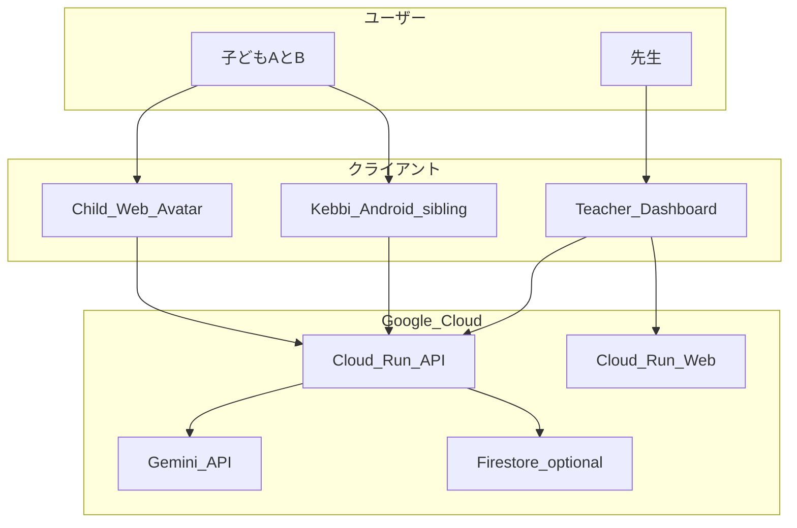

# アーキテクチャ

## 概要

Nakanaori Agent は Google Cloud 上のマルチエージェント ADK ワークフローで、学校の小さなケンカを仲介します。子どもは Web アバターまたは Kebbi ロボットと話し、先生は構造化された非裁断的ブリーフを受け取ります。

## システムコンテキスト

## リポジトリ構成

| パス | 目的 |
|------|------|
| `agents/nakanaori/` | ADK エージェントとプロンプト |
| `services/api/` | FastAPI REST サービス |
| `services/web/` | React 先生 + 子ども UI |
| `clients/kebbi/` | API 契約（実装は外部） |
| `aidlc-docs/` | AI-DLC Inception/Construction 成果物 |
| `.aidlc-rule-details/` | AI-DLC ワークフロールール |
| `infrastructure/` | Cloud Run YAML、Terraform（将来） |

## エージェントワークフロー

1. **ListenerAgent** — 各子どもを個別にヒアリング
2. **EmotionGuardAgent** — 各ターンでエスカレーション確認
3. **FactStructurerAgent** — 事実 / 感情 / 不明点を構築
4. **ConfirmationAgent** — 読み返しと訂正受付
5. **TeacherBriefAgent** — 先生向けレポート生成

**SessionOrchestrator** が明示的な状態マシンでオーケストレーション。

## 倫理

`.cursor/rules/nakanaori-product.mdc` および `.aidlc-rule-details/extensions/child-safety/nakanaori/` を参照。

## 関連ドキュメント

- [デモシナリオ](./demo-scenario.md)
- [DevOps](./devops.md)
- [ハッカソン提出](./hackathon-submission.md)
- [Kebbi API 契約](../clients/kebbi/api-contract.md)
