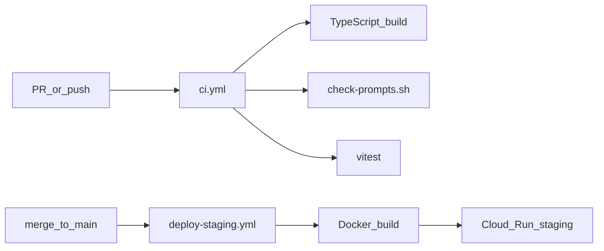

# DevOps — つくる・まわす・とどける

ハッカソン概念および AI-DLC Operations フェーズに沿った構成。

## パイプライン



## CI（`/.github/workflows/ci.yml`）

push と PR のたびに:

1. Node lint + build — `@nakanaori/agents`、`nakanaori-api`
2. プロンプト禁止語チェック — `scripts/check-prompts.sh`
3. ユニットテスト — Vitest（agents）
4. TypeScript チェック — `services/web/`

## デプロイ（`/.github/workflows/deploy-staging.yml`）

**方針**: AIxR-API とは **別 Cloud Run サービス**（`nakanaori-api` / `nakanaori-web`）。初回セットアップ: [hackathon-staging-deploy.md](./hackathon-staging-deploy.md) · `scripts/bootstrap-staging-gcp.sh`

`main` への push 時:

1. API Docker イメージをビルド → Artifact Registry（`nakanaori/api`）
2. Cloud Run に `nakanaori-api` をデプロイ（`GEMINI_API_KEY` は Secret Manager に **ENABLED** 版があるときのみ注入；無効/未設定時は stub モード）
3. デプロイ済み API URL を取得
4. Web Docker イメージを `VITE_API_BASE_URL` 付きでビルド → `nakanaori-web` をデプロイ

API は CORS を有効化済み（Web 別オリジンから `/v1/*` を呼び出し可能）。

### 秘密情報の置き場所（公開リポジトリ）

| 種別 | 置き場所 | 例 |
|------|----------|-----|
| CI デプロイ権限 | **GitHub Actions Secrets** | `GCP_PROJECT_ID`, `GCP_SA_KEY` |
| 実行時 API キー | **GCP Secret Manager** | `GEMINI_API_KEY` → Cloud Run `--set-secrets` |
| ローカル開発 | **`.env`**（gitignore） | `.env.example` をコピー |

`GEMINI_API_KEY` は GitHub Secret に **置かない**。

### 必要な GitHub Secrets

| Secret | 目的 |
|--------|------|
| `GCP_PROJECT_ID` | GCP プロジェクト |
| `GCP_SA_KEY` | デプロイ用サービスアカウント JSON |

## プロンプトガバナンス

- プロンプト: `packages/agents/src/prompts/`
- CI が裁きラベルをブロック（悪い子、guilty、verdict 等）
- プロンプト変更は PR レビュー必須

## 監視（Operations — まわす）

API は **構造化 JSON ログ** を stdout に出力します（Cloud Run → Cloud Logging）。

| フィールド | 意味 |
|-----------|------|
| `event` | `session.created` / `session.child_turn` / `session.escalated` / `session.ready_for_teacher` / `session.insights_refresh` |
| `session_id` | セッション UUID |
| `state` / `previous_state` | エージェント状態機械 |
| `agent_name` | `Listener` / `FactStructurer` / `EmotionGuard` / `SessionOrchestrator` |
| `escalated` | 緊急エスカレーション |
| `git_sha` | デプロイ revision（`GIT_SHA` env） |

実装: `services/api/src/logger.ts`

### Cloud Logging クエリ例

**エスカレーションのみ**

```text
resource.type="cloud_run_revision"
resource.labels.service_name="nakanaori-api"
jsonPayload.event="session.escalated"
```

**セッション追跡**

```text
resource.type="cloud_run_revision"
resource.labels.service_name="nakanaori-api"
jsonPayload.session_id="YOUR-SESSION-UUID"
```

**デプロイ revision 確認**

```text
resource.type="cloud_run_revision"
resource.labels.service_name="nakanaori-api"
jsonPayload.event="service.start"
```

### デプロイ後スモーク

`main` push → Deploy Staging 完了時に自動実行（`scripts/smoke-staging.sh`）:

1. `GET /health`
2. Web トップ HTML
3. `POST /v1/sessions`

手動:

```bash
API_URL=https://nakanaori-api-xxxxx.run.app \
WEB_URL=https://nakanaori-web-xxxxx.run.app \
bash scripts/smoke-staging.sh
```

---

## Runbook（staging 運用）

### GEMINI_API_KEY — 審査用 ON / 普段 OFF

| 操作 | コマンド |
|------|----------|
| **ON**（LLM 有効） | Secret Manager にキー有効化 → `gcloud run services update nakanaori-api --region asia-northeast1 --set-secrets GEMINI_API_KEY=GEMINI_API_KEY:latest` |
| **OFF**（スタブ・課金抑制） | `gcloud run services update nakanaori-api --region asia-northeast1 --remove-secrets GEMINI_API_KEY` |

Secret Manager だけ無効化しても **実行中コンテナには残る** — 必ず Cloud Run **新 revision** を出す。

起動ログ `service.start` の `llm_enabled` で確認。

### 再デプロイ

- `main` へ merge → GitHub Actions `deploy-staging.yml`
- または GCP コンソール → Cloud Run → 新 revision

### プロンプト変更

1. `packages/agents/src/prompts/` を編集
2. PR → CI（`check-prompts.sh` が禁止語をブロック）
3. merge → staging 自動反映

### トラブル時

| 症状 | 確認 |
|------|------|
| teacher_hints 空 | `llm_enabled: false` → GEMINI ON |
| deploy 失敗 | Actions ログ / Secret Manager / Artifact Registry |
| 暴力検知の確認 | Logging で `session.escalated` |

---

## 監視（将来）

## ローカル開発

```bash
npm install
npm run dev --workspace=nakanaori-api
```

一括起動（API + Web）:

```bash
bash scripts/dev-stack.sh
```

## Kebbi 実機（sibling repo）

| スクリプト | 用途 |
|-----------|------|
| `scripts/kebbi-deploy.sh` | ビルド・インストール・`MainActivity` 起動 |
| `scripts/kebbi-ensure-sdk.sh` | Android SDK / `local.properties` 確認 |
| `scripts/kebbi-status.sh` | アプリ起動中か `adb` で確認 |
| `scripts/kebbi-logcat.sh` | `NakanaoriKebbi` タグ logcat |
| `scripts/kebbi-logcat-clear.sh` | logcat クリア |

`NAKANAORI_KEBBI_ROOT` で `nakanaori-kebbi` のパスを上書き。

手順・トラブルシューティング: [kebbi-dev-guide.md](./kebbi-dev-guide.md)

## 環境

`infrastructure/cloud-run/env.example` を `.env` にコピー（コミット禁止）。
