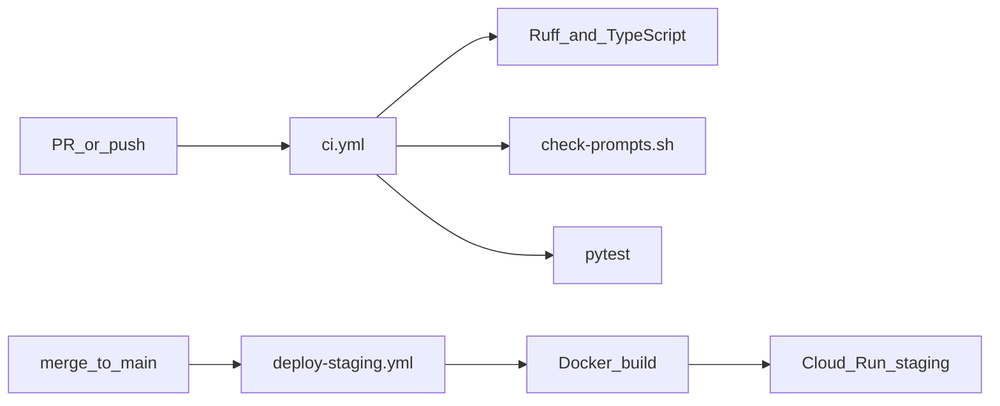

# DevOps — つくる・まわす・とどける

ハッカソン概念および AI-DLC Operations フェーズに沿った構成。

## パイプライン



## CI（`/.github/workflows/ci.yml`）

push と PR のたびに:

1. Python lint（ruff）— `agents/`、`services/api/`
2. プロンプト禁止語チェック — `scripts/check-prompts.sh`
3. ユニットテスト — pytest
4. TypeScript チェック — `services/web/`

## デプロイ（`/.github/workflows/deploy-staging.yml`）

`main` への push 時:

1. API Docker イメージをビルド → Artifact Registry
2. Cloud Run（staging）に `nakanaori-api` をデプロイ
3. web Docker イメージをビルド → `nakanaori-web` をデプロイ（同一 workflow に拡張予定）

### 必要な GitHub Secrets

| Secret | 目的 |
|--------|------|
| `GCP_PROJECT_ID` | GCP プロジェクト |
| `GCP_SA_KEY` | デプロイ用サービスアカウント JSON |
| `GEMINI_API_KEY` | Secret Manager または env 経由で Cloud Run に注入 |

## プロンプトガバナンス

- プロンプト: `agents/nakanaori/prompts/`
- CI が裁きラベルをブロック（悪い子、guilty、verdict 等）
- プロンプト変更は PR レビュー必須

## 監視（Operations）

- Cloud Logging: エージェント遷移の構造化 JSON ログ
- ログフィールド: `session_id`、`agent_name`、`state`、`escalated`
- 将来: エラー率に対する Cloud Monitoring アラート

## ローカル開発

```bash
# API
cd services/api && uvicorn nakanaori_api.main:app --reload --port 8080

# Web
cd services/web && npm install && npm run dev
```

## 環境

`infrastructure/cloud-run/env.example` を `.env` にコピー（コミット禁止）。
