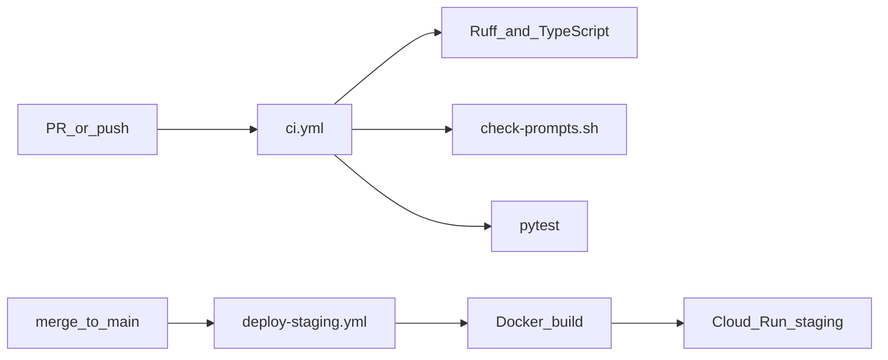

# DevOps — つくる・まわす・とどける

Aligned with hackathon concepts and AI-DLC Operations phase.

## Pipeline



## CI (`/.github/workflows/ci.yml`)

On every push and PR:

1. Python lint (ruff) — `agents/`, `services/api/`
2. Prompt forbidden-word check — `scripts/check-prompts.sh`
3. Unit tests — pytest
4. TypeScript check — `services/web/`

## Deploy (`/.github/workflows/deploy-staging.yml`)

On push to `main`:

1. Build API Docker image → Artifact Registry
2. Deploy `nakanaori-api` to Cloud Run (staging)
3. Build web Docker image → deploy `nakanaori-web` (optional same workflow)

### Required GitHub Secrets

| Secret | Purpose |
|--------|---------|
| `GCP_PROJECT_ID` | GCP project |
| `GCP_SA_KEY` | Service account JSON for deploy |
| `GEMINI_API_KEY` | Injected to Cloud Run via Secret Manager or env |

## Prompt Governance

- Prompts in `agents/nakanaori/prompts/`
- CI blocks judgment labels (悪い子, guilty, verdict, etc.)
- Changes to prompts require PR review

## Monitoring (Operations)

- Cloud Logging: structured JSON logs for agent transitions
- Log fields: `session_id`, `agent_name`, `state`, `escalated`
- Future: Cloud Monitoring alerts on error rate

## Local Development

```bash
# API
cd services/api && uvicorn nakanaori_api.main:app --reload --port 8080

# Web
cd services/web && npm install && npm run dev
```

## Environment

Copy `infrastructure/cloud-run/env.example` to `.env` locally (never commit).
