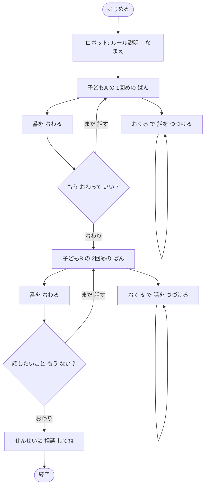

# 子ども会話フロー — わかりやすいながれ

小学低学年向け。**1回め・2回め の ばん** で、2人 話したら **先生に 相談** する流れです。

---

## 全体の流れ

---

## 各ステップ

| 段階 | 子どもが すること | ロボット / 画面 |
|------|-------------------|-----------------|
| 開始前 | 「はじめる」を 押す | ながれ 4ステップを 表示 |
| 最初 | なまえを 送る | 「1回め / 2回め の ばん」と 説明 |
| 話す | 「おくる」で 話を つづける | 聞き役（裁かない） |
| 番を 終える | 「番を おわる」を 押す | 「もう おわって いい？」と 確認 |
| A → B | 確認で「おわり」 | つぎの 子に 挨拶 |
| 最後（B） | 確認で「おわり」 | 「せんせいに 相談してね」で 終了 |

---

## ボタンの意味

| ボタン | 意味 |
|--------|------|
| **おくる** | いまの 番の なかで、話を 1つ 追加する |
| **番を おわる** | いまの 子の ばんを 終える（確認 あり） |
| **まだ 話す** | 確認を やめて、話を つづける |
| **おわり** | 本当に 番を 終える |

---

## デモ台本

消しゴムの 例は [eraser-story-dialogue.md](./eraser-story-dialogue.md) を 参照。

---

## 実装参照

| 領域 | ファイル |
|------|----------|
| ロボット文言 | `packages/agents/src/agents/child-navigator.ts` |
| 確認 UI | `services/web/src/child/ChildView.tsx` |
| UI 文言 | `services/web/src/lib/child-copy.ts` |
